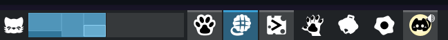

# Wha?

A very very light icon theme for KDE Plasma... featuring cat imagary!

I do not intend on making this a full-fledged desktop icon set, as those can go up to 4000-8000 apps! These just relate to apps that I enjoy personally using on my gaming PC.

If there are suggestions for other icons, feel free to bring them up in the [issues tab](https://github.com/theBlackHatOrangeCat/cat_icon_theme/issues) !

Alternatively, you're welcome to submit your own icon for an application too - the current icons mostly follow a monochrome aesthetic, and also use vector graphics, from an application like [inkscape](https://inkscape.org). After insterting your image, you'll need to symbolic-link it into `scalable/apps`, and name it based on the apps launch name / icon it's looking for

# How to install!

1. Download the zip from releases
2. Unzip the folder into some place like your Pictures directory
3. Open plasma settings: Appearance & Style > Colors & Themes > Icons > "Install from file..."
4. Select the `index.theme` file
5. Click "Apply" on the bottom right corner!

For a list of supported apps, you can find that in the list of scalable icons: [here](./scalable/apps) !

# Gallery

# License

 This work is licensed under a <a rel="license" href="http://creativecommons.org/licenses/by/4.0/">Creative Commons Attribution 4.0 International License</a>.
